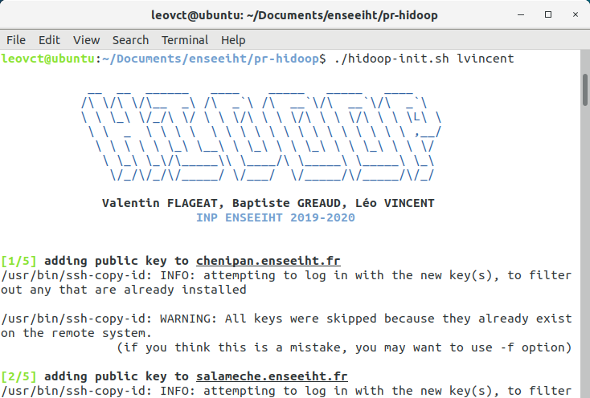
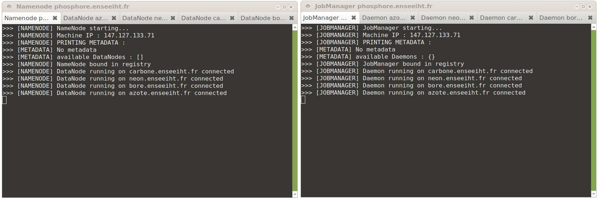

<div align="center">
    
    <br/>
    
    <br/>
     
</div>

<br/>
**Hidoop is a platform developed in Java, allowing the execution of applications based on MapReduce programming model on a computer cluster.**  

This project is our very first work on the theme of competing applications for intensive computing and mass data processing.  
It consists in a lite version of [Hadoop](https://hadoop.apache.org/) (developed by Apache) and it is composed of two modules:
* :file_folder: **A distributed file-system** managing data storing on a cluster - _inspired by **H**adoop **D**istributed **F**ile **S**ystem (HDFS)_
* :diamond_shape_with_a_dot_inside: **An implementation of the MapReduce programming model** for large-scale data processing - _inspired by Hadoop MapReduce_

## Table of contents
<details>
<summary>Click to expand</summary>

- [**Overview**](#overview)
- [**Getting started** :pushpin:](#getting-started-pushpin)
    - [Prerequisites](#prerequisites)
    - [Installation](#installation)
    - [Configuration](#configuration)
        - [Servers addresses](#servers-addresses)
        - [Other settings](#other-settings)
- [**Run Hidoop** :rocket:](#run-hidoop-rocket)
    - [Deployment](#deployment)
    - [Launching](#launching)
    - [Shutdown](#shutdown)
- [**Spread data on the cluster using HDFS** :file_folder:](#spread-data-on-the-cluster-using-hdfs-file_folder)
    - [Data Format](#data-format)
        - [Line format](#line-format)
        - [KV format](#kv-format)
    - [Write a file on HDFS](#write-a-file-on-hdfs)
    - [Read a file from HDFS](#read-a-file-from-hdfs)
    - [Delete a file from HDFS](#delete-a-file-from-hdfs)
- [**Run a MapReduce application on the cluster** :diamond_shape_with_a_dot_inside:](#run-a-mapreduce-application-on-the-cluster-diamond-shape-with-a-dot-inside)
    - [Application WordCount](#application-wordcount)
    - [Application QuasiMonteCarlo](#application-quasimontecarlo)
- [**Contributors** :busts_in_silhouette:](#contributors-busts_in_silhouette)
</details>

## Overview

This application allows its user to **process large data sets across multiple servers** using the MapReduce programming model.  
This programming model is used to **parallelize the processing of large-scale data** among a cluster.
Each server from the cluster processes a small part of data.

In this project, processing data takes place in 3 steps:  
* Data (provided as a file) is cut into small chunks and spread over the servers (process managed by __HDFS__)
* Each server processes a small part amount data (__Map__)
* Server results are collected and aggregated (__Reduce__)

__Map__ and __Reduce__ processes depend on the purpose of the MapReduce application, and can be entirely designed by user.
The strength of this model lies in the parallelization of processes.  
For example, MapReduce programming model can be use to parallelize the counting of the number of occurrences of a specific word in a large dataset.

## Getting started :pushpin:

### Prerequisites

* Current version must be run on a **Linux** system.
* Current version also needs [MATE Terminal](https://mate-desktop.org/) to be installed on the system.
* All servers (or machine) must be in a same **network**, **accessible by the machine running the project**.
* Servers need to be accessible via **SSH**.
* All servers must have a **recent version of Java** (1.8 or more recent).
* Java compiler used must produce code that is **executable by all servers**.

### Installation

Project must be cloned on a Linux system, which will be responsible for the deployment of the platform within the cluster.

### Configuration

#### Servers addresses

Servers that are part of the cluster must be filled in file _config/servs.config_.
Addresses must be written line by line as in the example below:

>__salameche.enseeiht.fr__  
>carapuce.enseeiht.fr  
>bulbizarre.enseeiht.fr  
>nidoran.enseeiht.fr  
>magicarpe.enseeiht.fr  

Server **written first** (at the top of the list) will automatically be set as **Master Server**, i.e. the server running central processes (NameNode and JobManager).

#### Other settings

Following settings can be configured in file _congif/settings.config_ ([KV format](#kv-format) file).  
These setting have to be written key-value pairs (watch out for white spaces), in any order, according to the following indications:

* **Chunk Size** \[___chunksize___ key\] : _strictly positive integer_, size of chunks (Mo) when files are written on HDFS
* **Data path on servers** \[___datapath___ key\] : _string_, path to folder where data will be stored (Hidoop executables & data processed) **on each server**
* **NameNode's Port** \[___portnamenode___ key\] : _strictly positive integer_, port used by NameNode
* **DataNodes' Port** \[___portdatanode___ key\] : _strictly positive integer_, port used by DataNodes
* **JobMaster's Port** \[___portjobmaster___ key\] : _strictly positive integer_, port used by JobMaster
* **Daemons' Port** \[___portdaemon___ key\] : _strictly positive integer_, port used by Daemons

## Run Hidoop :rocket:

Once the project is configured (see section above), running the platform is a **2-step procedure**.  
First executable files have to be **deployed** on the cluster, then the platform has to be **launched**.

### Deployment

Open a terminal in project's **root folder** and execute _hidoop-init.sh_ bash script by typing the following command:  
```
./hidoop-init.sh <username>
```
**\<username\>** has to be replaced with the username to be used for SSH connection on servers.  
_Note: SSH command used within bash scripts is `ssh <username>@<serveraddress>`, e.g. `ssh lvincent@salameche.enseeiht.fr`_.

A logo signalling the begining of the deployment should appear.  
**Deployment might take a few time**: executable files are copied on each machine of the cluster.

<br/>
<div align="center">
  
</div>
<br/>

### Launching

In a terminal in project's **root folder**, execute _hidoop-run.sh_ bash script by typing the following command:  
```
./hidoop-run.sh <username>
```
Same remark as for the deployment, **\<username\>** has to be replaced with the username to be used for SSH connection on servers.

**Two terminals** with tabs should show-up as in the picture below, **displaying the status of the different entities of Hidoop** running on servers.  
On the first terminal, you can track the status of the **NameNode** and the four **DataNodes**.  
On the second terminal, you can track the status of the **JobManager** and the four **Daemons**.  

<br/>
<div align="center">
  
</div>
<br/>

**Hidoop is now ready for use !**

## Shutdown

To clean up everything related to Hidoop from the cluster (binaries, data and Java processes), execute _hidoop-clear.sh__ bash script from project's root folder :  

```
./hidoop-clear.sh <username>
```
Same remark as for the deployment, **\<username\>** has to be replaced with the username to be used for SSH connection on servers.
The process Java: NameNode, DataNode, JobManager and Daemon should be killed and the data stored on each server should be erased.


## Spread data on the cluster using HDFS :file_folder:

To run MapReduce applications processing data, **the data must first be distributed on the cluster** using **HDFS**. Data is cut into small chunks and spread over the servers.  

In this project, HDFS provides 3 main functionnalities:
* **Write data :** cut a provided file into chunk and spread them over the servers
* **Read data :** retrieve data that has been written on servers by _write_ process in order to rebuild the original file
* **Delete data :** delete data stored by servers concerning a specified file

The following instructions can only work if Hidoop platform is running on the cluster (see section above).  

:warning: ___This project is still under development, please do not try to proceed any sensitive data without making a copy.___


### Data Format

Data to process must be stored as a file. Current version of the project supports two types of format.  
**Format support will be later improved.**  

#### Line format
In line format, text is written **line by line**. A line of text is considered a unit of data, so it should not be too long.  

Here is an example of line format file content :  
> This is the content of the file.  
> It should be written line by line,  
> lines' length should not be too disparate,  
> file can be as large as desired.  

#### KV format
In KV format, text file is composed of key-value pairs. Each pair is written **on a line**, separator is *\<-\>* symbol.  

Here is an example of KV format file content :  
>movie<->inception  
>series<->game-of-thrones  
>dish<->pizza  
>colour<->blue  

### Write a file on HDFS

To write a large file in HDFS (corresponds to **spreading data among servers**), open a terminal in project's **root folder** and execute following command:
```
java -cp bin hdfs.HdfsClient write <line|kv> <sourcefilename> [replicationfactor]
```
* *\<line|kv\>* corresponds to input file format, line or KV format.  
* *\<sourcefilename\>* is the name of the file to proceed.
* *\[replicationfactor\]* is an **optional** argument. It corresponds to the replication factor of the file, i.e. the number of time each chunk is duplicated on the cluster, in order to anticipate server failures. **Default value is 1**.

_Note: -cp is a shortcut for -classpath._

### Read a file from HDFS

To read a file from HDFS (corresponds to **retrieving data from servers**), open a terminal in project's **root folder** and execute following command:
```
java -cp bin hdfs.HdfsClient read <filename> <destfilename>
```
* *\<sourcefilename\>* is the name of the file (written on HDFS previously) to read from the servers.
* *\<destfilename\>* is the name of the file to store data retrieved by process (rebuilt file).

### Delete a file from HDFS

To delete a file from HDFS (corresponds to **deleting data from servers**), open a terminal in project's **root folder** and execute following command:
```
java -cp bin hdfs.HdfsClient delete <sourcefilename>
```
* *\<sourcefilename\>* is the name of the file (written on HDFS previously) to delete from HDFS.

## Run a MapReduce application on the cluster :diamond_shape_with_a_dot_inside:

MapReduce application models are given in _src/application_ package (see _WordCount\_MapReduce.java_ and _MonteCarlo\_MapReduce.java_).  

:warning: **The following instructions can only work if Hidoop platform is running on the cluster and the data is spread within the cluster.**

Note: It is also possible to run MapReduce applications that do not take a file as a parameter (for example QuasiMonteCarlo application that generates a number of points in a unitary square and which calculates the number of points inside the circle inscribed in the square in order to approach the value of pi).

### WordCount application

**Wordcount** is a MapReduce application runnable on Hiddop platform.  
This application counts the number of occurrences of each word in a large text file in line format.  
The application is located in package _src/application/_.

_Note: We have also implemented an iterative version to compare the differences of performance on very large files (> 10 GB)._

Make sure you have written the file in HDFS before launching the application. Then, execute following code from a terminal opened in project's **root folder**:
```
java -cp bin application.WordCount_MapReduce <filename>
```
*\<filename\>* is the name of the file (written on HDFS previously) to process.

> Example of use: 
>
> Let's say you would want to count the number of occurrences of all every word in a large 50GB text file, stored on your system at data/filesample.txt.  
> The first step is to write the file in HDFS :  
> `java -cp bin hdfs.HdfsClient write line data/filesample.txt 1`  
> The next step is to run the WordCount application by specifying the file name (without the path because HDFS is a flat hierarchy) :  
> `java -cp bin application.WordCount_MapReduce filesample.txt`  
> The result of the process is written in the file _results/resf-filesample.txt_, in KV format.  

_Note: It is possible to compare the performances of MapReduce applications with their iterative versions, also present in the package *src/application*._  
_Keep in mind that *time savings will only be noticeable on very large files (> 10 Go)*, not taking into account time spent writing files on HDFS._
_Indeed, the MapReduce process is quite expensive and is only useful on large data sets._  
***:warning: This project is still under development, the results may not be very significant at this time.***

### QuasiMonteCarlo application

We have developed a MapReduce version of the **QuasiMonteCarlo** algorithm.  
It generates a number of X points in a unit square during the Map operation and then calculates the number of points inside the circle inscribed in this square during the Reduce operation.  
It then derives an approximation of 𝝅.

This application is **complementary to the WordCount application** because it does not take a file as a parameter on which to execute operations.  
Moreover, the application does not manage the distribution of Map and Reduce operations on the cluster in the same way.  
Indeed, since no Map operation is performed on chunks because the application does not take a file in parameter, a Map and Reduce operation is launched on each available daemon.

To launch the QuasiMonteCarlo application, simply and run the following command from project's root folder:
```
java -cp bin application.QuasiMonteCarlo_MapReduce
```
Note: By default, the application generates 10⁶ points per Daemon.

## Contributors :busts_in_silhouette:

[Valentin Flageat](https://github.com/vaflag) - [Baptiste Gréaud](https://github.com/bgreaud) - [Léo Vincent](https://github.com/leovct)