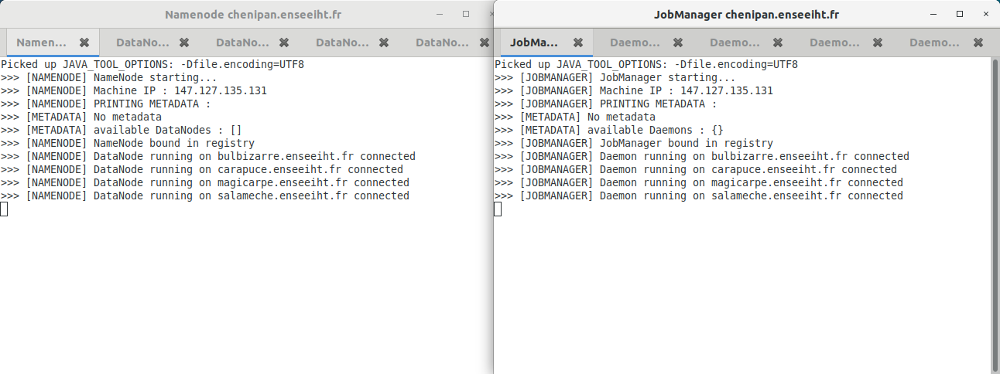

# Hidoop     
   
Simple **Big Data Platform** running **MapReduce applications**, inspired by Hadoop.  
This platform allows the execution of applications based on MapReduce programming model on a cluster.

This project is a very first experiment on the theme of competing applications for intensive computing and mass data processing.  
It consists in a lite version of Hadoop, composed of two modules :
* :file_folder: **A distributed file-system** managing data storing on a cluster - _inspired by Hadoop Distributed File System (HDFS)_
* :eight_spoked_asterisk: **An implementation of the MapReduce programming model** for large-scale data processing - _inspired by Hadoop MapReduce_

## Overview

This application allows its user to **process large data sets across multiple servers** using the MapReduce programming model.  
MapReduce programming model is used to **parallelize the processing of large-scale data** among a cluster. Each server from the cluster processes a small part of data.
In this project, processing data takes place in 3 steps :  
* Data (provided as a file) is cut into small chunks and spread over the servers (process managed by __HDFS__)
* Each server processes a small part amount data (__Map__)
* Server results are collected and aggregated (__Reduce__)

__Map__ and __Reduce__ processes depend on the purpose of the MapReduce application, and can be entirely designed by user. The strength of this model lies in the parallelisation of processes.  
For example, MapReduce programming model can be use to parallelize the counting of the number of occurrences of a specific word in a large dataset.

## Getting started :pushpin:

### Prerequisites

* Current version must be run on a **Linux** system
* Current version also needs [MATE Terminal](https://mate-desktop.org/) to be installed on the system
* All servers (or machine) must be in a same **network**, **accessible by the machine running the project**
* Servers need to be accessible via **SSH**
* All servers must have a recent version of java (1.8 or more recent)
* Java compiler used must produce code that is **executable by all servers**

### Installation

Project must be cloned on a Linux system, which will be responsible for the deployment of the platform within the cluster.

### Configuration

#### Servers addresses

Servers that are part of the cluster must be filled in file _config/servs.config_.
Addresses must be written line by line as in the example below :

>__phosphore.enseeiht.fr__  
>azote.enseeiht.fr  
>neon.enseeiht.fr  
>carbone.enseeiht.fr  
>bore.enseeiht.fr  

Server **written first** (at the top of the list) will automatically be set as **Master Server**, i.e. the server running central processes (NameNode & JobManager).

#### Other settings

Extra settings can be configured, such as **chunk size** or **data storage folder** where to store data on servers. Current version of the project requires these parameters to be configured directly in the code, in file _src/config/settingsManager.java_, in _\*.sh_ and _config/*.sh_ bash scripts.

## Run Hidoop :fast_forward:

Once the project is configured (see section above), running the platform is a **2-step procedure**.  
First executable files have to be **deployed** on the cluster, then the platform has to be **launched**.

### Deployment

Open a terminal in project's **root folder** and execute _hidoop-init.sh_ bash script by typing following command :  
```
./hidoop-init.sh <username>
```
**\<username\>** has to be replaced with the username to be used for SSH connection on servers (command launched within bash scripts is `ssh <username>@<serveraddress>`).

A logo signalling the begining of the deployment should appear. Deployment might take a few time.

<p align="center">
  
<br/>

### Launching

In a terminal in project's **root folder**, execute _hidoop-run.sh_ bash script by typing following command :  
```
./hidoop-run.sh <username>
```
**\<username\>** has to be replaced with the username to be used for SSH connection on servers (command launched within bash scripts is `ssh <username>@<serveraddress>`).

**Two terminals** with tabs should show-up, **displaying the status** of the different entities of Hidoop running on servers.

<p align="center">
  
<br/>

Hidoop is now ready for use.

## Spread data on servers using HDFS :file_folder:

To run MapReduce applications processing data, the data must first be distributed on the cluster.
HDFS is the module of Hidoop used to **write data across the cluster**.  
Data is cut into small chunks and spread over the servers.  
In this project, HDFS provides 3 main functionnalities :

* **Write data :** cut a provided file into chunk and spread them over the servers
* **Read data :** retrieve data that has been written on servers by _write_ process in order to rebuild a file
* **Delete data :** delete data stored by servers concerning a specified file

The following instructions can only work if Hidoop platform is running on the cluster (see section above).
**This project is still under development, please do not try to proceed any meaningful data without making a copy.**

### Write a file on HDFS

To write a large file in HDFS (corresponds to **spread data among servers**), open a terminal in project's **root folder** and execute following command :
```
java -classpath bin hdfs.HdfsClient write <line|kv> <sourcefilename> <replicationfactor>
```
* *\<line|kv\>* corresponds to input file format. Current version of the project only supports two text file formats : line by line or kv.  
* *\<sourcefilename\>* is the name of the file to proceed.
* *\<replicationfactor\>* is an optional argument. It corresponds to the replication factor of the file, i.e. the number of time each chunk is duplicated on the cluster, in order to anticipate server failures. Default is 1.

### Read a file from HDFS

To read a file from HDFS (corresponds to **retrieve data from servers**), open a terminal in project's **root folder** and execute following command :
```
java -classpath bin hdfs.HdfsClient read <filename> <destfilename>
```
* *\<sourcefilename\>* is the name of the file to read from the servers. It corresponds to the name of a file that has been written on HDFS previously.
* *\<destfilename\>* is the name of the file to store data retrieved by process (rebuilt file).

### Delete a file from HDFS

To delete a file from HDFS (corresponds to **delete data from servers**), open a terminal in project's **root folder** and execute following command :
```
java -classpath bin hdfs.HdfsClient delete <sourcefilename>
```
* *\<sourcefilename\>* is the name of the file to delete from HDFS. It corresponds to the name of a file that has been written on HDFS previously.

## Run a MapReduce application on the cluster :eight_spoked_asterisk:

MapReduce application models are given in _src/application_ package (_WordCount\_MapReduce.java_ & _MonteCarlo\MapReduce.java_).
The following instructions can only work if Hidoop platform is running on the cluster.  
To run MapReduce applications processing data, the **data must first be distributed on the cluster** (see HDFS section above).

### Example : Running WordCount application

_src/application/WordCount\_MapReduce.java_ is a MapReduce application runnable on Hiddop platform.  
This application counts the number of occurrences of each word in a large text file in line format (text file composed of lines).  
First, **file must be written on HDFS** as described in _Write a file on HDFS_ section.  
Then, execute following code from a terminal opened in project's **root folder** :
```
java -classpath bin application.WordCount_MapReduce \<filename\>
```
*\<sourcefilename\>* is the name of the file to process. It corresponds to the name of a file that has been written on HDFS previously.

> Example : 
> Large file to process is stored on system, at path _data/filesample.txt_
> First, write the file on HDFS : `java -classpath bin hdfs.HdfsClient write line data/filesample.txt 1`
> Then, execute the WordCount application by specifying the name of the file (without the path, HDFS is a flat hierarchy) : `java -classpath bin application.WordCount_MapReduce filesample.txt`
> Result of process is written in _filesample.txt-resf_ file (in KV format) in project's root folder

### Contributors
Valentin Flageat, Baptiste Gréaud, Léo Vincent